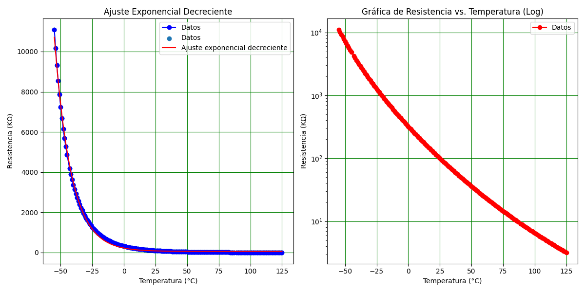

# Curve Fitting of the NTC

## Structure:
- NTCM-100K-B3950.pdf: Datasheet of the sensors.
- NTCM-100K-B3950.csv: Data in CSV format for the sensors.
- LUT_res_temp.csv: Data in CSV format for the average resistance of the sensors vs. temperature. 
- datos_a_LUT: A script that transforms the data into a Look-Up Table (LUT), generating LUT_res_temp.csv.
- proceso_datosd.py: A script that takes data from NTCM-100K-B3950.csv and performs an exponential curve fitting, providing the curve coefficients and a graph of the curve.

## Results:

### Graph and Obtained Function:

Fit Parameters: a = 166.74, b = 0.08, c = 58.54

Fitting Function: R = 166.74 * exp(-0.08 * T) + 58.54

### Obtained LUT:

| Temperature (C) | Resistance (K) |
|-----------------|----------------|
| -55.0           | 11093.8        |
| -54.0           | 10156.1        |
| -53.0           | 9311.69        |
| -52.0           | 8549.81        |
| -51.0           | 7861.2         |
| -50.0           | 7237.73        |
| -49.0           | 6672.31        |
| -48.0           | 6158.7         |
| -47.0           | 5691.44        |
| -46.0           | 5265.69        |
| -45.0           | 4877.2         |
| -43.0           | 4197.42        |
| -42.0           | 3899.83        |
| -41.0           | 3626.83        |
| -40.0           | 3376.08        |
| -39.0           | 3145.49        |
| -38.0           | 2933.2         |
| -37.0           | 2737.53        |
| -36.0           | 2556.98        |
| -35.0           | 2390.22        |
| -34.0           | 2236.03        |
| -33.0           | 2093.33        |
| -32.0           | 1961.13        |
| -31.0           | 1838.54        |
| -30.0           | 1724.78        |
| -29.0           | 1619.1         |
| -28.0           | 1520.85        |
| -27.0           | 1429.44        |
| -26.0           | 1344.32        |
| -25.0           | 1265.0         |
| -24.0           | 1191.02        |
| -23.0           | 1121.98        |
| -22.0           | 1057.5         |
| -21.0           | 997.241        |
| -20.0           | 940.885        |
| -19.0           | 888.148        |
| -18.0           | 838.764        |
| -17.0           | 792.494        |
| -16.0           | 749.115        |
| -15.0           | 708.422        |
| -14.0           | 670.228        |
| -13.0           | 634.359        |
| -12.0           | 600.657        |
| -11.0           | 568.973        |
| -10.0           | 539.171        |
| -9.0            | 511.127        |
| -8.0            | 484.723        |
| -7.0            | 459.851        |
| -6.0            | 436.413        |
| -5.0            | 414.316        |
| -4.0            | 393.473        |
| -3.0            | 373.806        |
| -2.0            | 355.239        |
| -1.0            | 337.705        |
| 0.0             | 321.14         |
| 1.0             | 305.482        |
| 2.0             | 290.679        |
| 3.0             | 276.676        |
| 4.0             | 263.427        |
| 5.0             | 250.886        |
| 6.0             | 239.012        |
| 7.0             | 227.764        |
| 8.0             | 217.106        |
| 9.0             | 207.005        |
| 10.0            | 198.53         |
| 11.0            | 188.343        |
| 12.0            | 179.724        |
| 13.0            | 171.545        |
| 14.0            | 163.78         |
| 15.0            | 156.407        |
| 16.0            | 149.403        |
| 17.0            | 142.748        |
| 18.0            | 136.423        |
| 19.0            | 130.41         |
| 20.0            | 124.692        |
| 21.0            | 119.253        |
| 22.0            | 114.078        |
| 23.0            | 109.152        |
| 24.0            | 104.464        |
| 25.0            | 100.0          |
| 26.0            | 95.747         |
| 27.0            | 91.697         |
| 28.0            | 87.837         |
| 29.0            | 84.157         |
| 30.0            | 80.65          |
| 31.0            | 77.305         |
| 32.0            | 74.115         |
| 33.0            | 71.072         |
| 34.0            | 68.167         |
| 35.0            | 65.395         |
| 36.0            | 62.749         |
| 37.0            | 60.222         |
| 38.0            | 57.809         |
| 39.0            | 55.503         |
| 40.0            | 53.3           |
| 41.0            | 51.195         |
| 42.0            | 49.183         |
| 43.0            | 47.259         |
| 44.0            | 45.419         |
| 45.0            | 43.659         |
| 46.0            | 41.975         |
| 47.0            | 40.364         |
| 48.0            | 38.822         |
| 49.0            | 37.346         |
| 50.0            | 35.84          |
| 51.0            | 34.58          |
| 52.0            | 33.284         |
| 53.0            | 32.043         |
| 54.0            | 30.853         |
| 55.0            | 29.713         |
| 56.0            | 28.62          |
| 57.0            | 27.573         |
| 58.0            | 26.568         |
| 59.0            | 25.605         |
| 60.0            | 24.681         |
| 61.0            | 23.794         |
| 62.0            | 22.944         |
| 63.0            | 22.127         |
| 64.0            | 21.344         |
| 65.0            | 20.592         |
| 66.0            | 19.869         |
| 67.0            | 19.175         |
| 68.0            | 18.509         |
| 69.0            | 17.869         |
| 70.0            | 17.253         |
| 71.0            | 16.662         |
| 72.0            | 16.094         |
| 73.0            | 15.548         |
| 74.0            | 15.022         |
| 75.0            | 14.517         |
| 76.0            | 14.031         |
| 77.0            | 13.564         |
| 78.0            | 13.114         |
| 79.0            | 12.681         |
| 80.0            | 12.265         |
| 81.0            | 11.864         |
| 82.0            | 11.478         |
| 83.0            | 11.106         |
| 84.0            | 10.748         |
| 85.0            | 10.404         |
| 86.0            | 10.071         |
| 87.0            | 9.751          |
| 89.0            | 9.146          |
| 90.0            | 8.859          |
| 91.0            | 8.583          |
| 92.0            | 8.316          |
| 93.0            | 8.06           |
| 94.0            | 7.812          |
| 95.0            | 7.573          |
| 96.0            | 7.342          |
| 97.0            | 7.12           |
| 98.0            | 6.905          |
| 99.0            | 6.698          |
| 100.0           | 6.498          |
| 101.0           | 6.304          |
| 102.0           | 6.118          |
| 103.0           | 5.937          |
| 104.0           | 5.763          |
| 105.0           | 5.595          |
| 106.0           | 5.433          |
| 107.0           | 5.276          |
| 108.0           | 5.124          |
| 109.0           | 4.977          |
| 110.0           | 4.836          |
| 111.0           | 4.698          |
| 112.0           | 4.566          |
| 113.0           | 4.438          |
| 114.0           | 4.314          |
| 115.0           | 4.194          |
| 116.0           | 4.077          |
| 117.0           | 3.965          |
| 118.0           | 3.856          |
| 119.0           | 3.751          |
| 120.0           | 3.649          |
| 121.0           | 3.551          |
| 122.0           | 3.455          |
| 123.0           | 3.363          |
| 124.0           | 3.273          |
| 125.0           | 3.186          |
