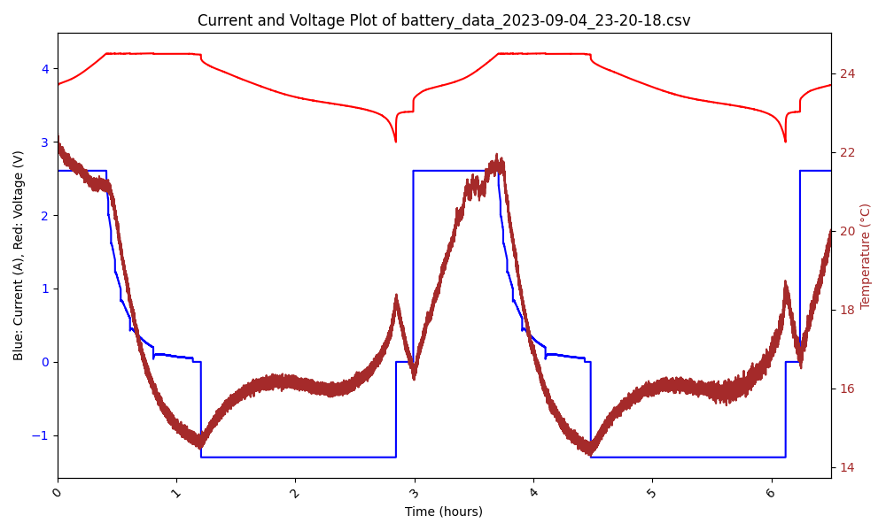
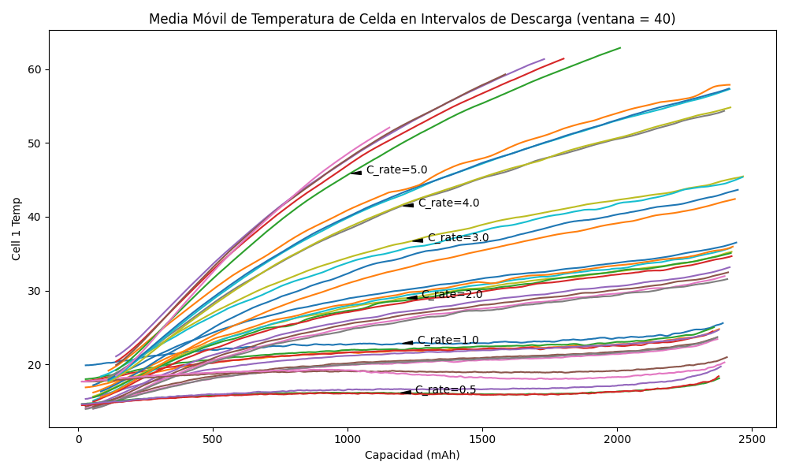
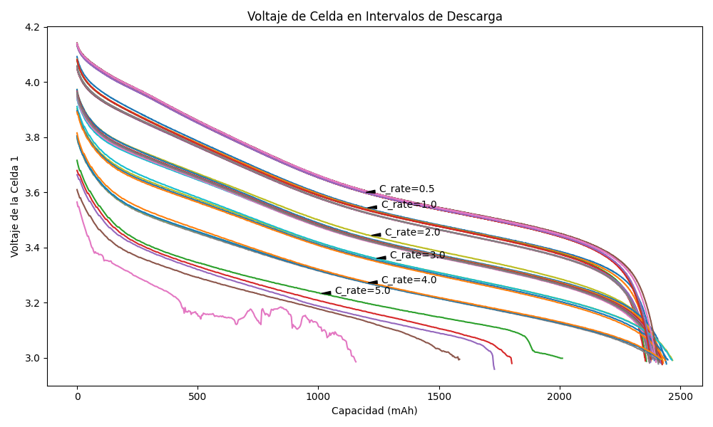
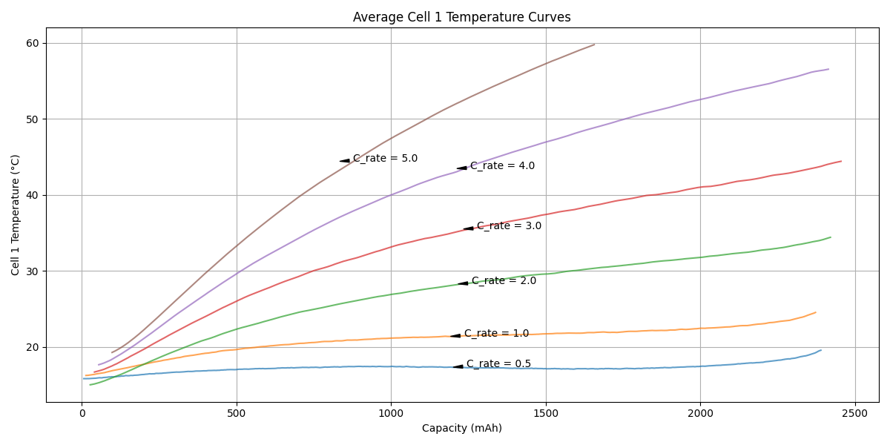
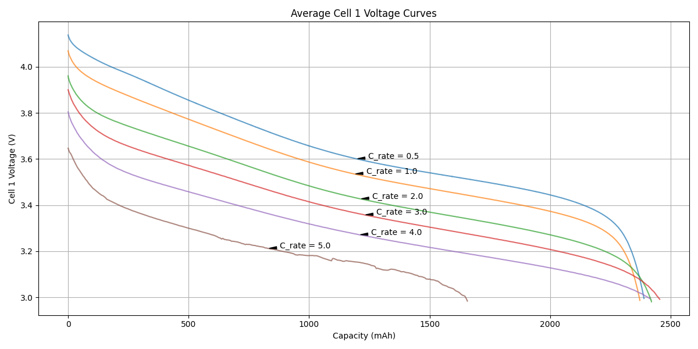

# Structure:
- battery_data_XXX...: Log obtained from a cycling process.
- graficar_csv.py: Generates a graph of values vs. time from the CSV files in the same directory as the script.
- graficar_temp_descarga.py: Generates a graph of temperatures vs. capacity.
- graficar_voltaje_descarga.py: Generates a graph of voltages vs. capacity.
- graficos_caracteristicos.py: Generates a representative graph, using SMA with a window size of 20, for voltages and temperatures for each detected C_rate during the cycling processes.
- separar_c_rates.csv: Creates a log for each distinct C_rate for data visualization purposes.
- tratamiento_datos_descarga: Processes data for subsequent visualization, interpolating points where no readings were received with the last valid value, generating datos_descarga_resampled.csv.
- unificar_datos_descarga.py: Combines data from all CSV files in the folder, REMOVING CSV files where discharge intervals do not exist, generating datos_descarga.csv.

# Workflow

## Data Preparation and Processing

Before visualizing the data, the following steps must be taken:

1. Execute unificar_datos_descarga.csv.
2. Execute tratamiento_datos_descarga.csv.
3. Execute separar_c_rates.csv.

This will create the necessary CSV files for data visualization. Below are the results that can be obtained.

# graficar_csv.py

Plots the data from one of the CSV files in the Logs folder.

# graficar_temp_descarga.py

Plots the discharge temperature vs. capacity.

# graficar_voltaje_descarga.py

Plots the discharge voltage vs. capacity.

# graficos_caracteristicos.py

Plots characteristic curves for each C_rate.

